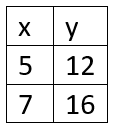
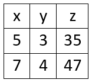
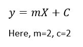

# Linear Regression
### What is Linear Regression?
Linear Regression is a statistical or mathematical approach for solving linear equations. A Linear Regression model finds the coefficient and intercepts from given input datas and predict output for any randomly given input.\
Linear Regression is the simpliest Machine Learning algorithm.
### When should we use Linear Regression?
1. When our dependent and independent variables are continious.
2. There needs to be a linear relationship between two variables.
3. There should be no significant outliner values in the data set.
### Real life fields where we use Linear Regression?
1. House price prediction
2. Blood pressure prediction
3. Car price prediction
4. Advertising cost prediction
5. Height prediction
### Types of Linear Regression: -
#### simple Linear Regression: -
When our output variable is dependent on only one variable then it is called simple linear regression. In the given data set y is only dependent on x, so it is a simple regression.

#### Multiple Linear Regression: -
when our output variable is dependent on two or more independent variables then it is called multiple linear regresssion. In the given data set output z is dependent on x and y.\

### How Linear Regression works?
Let us consider, this is an dataset.\
\
Now the relation between X and y is\
\
Main motive of our model is to find the Intercept(m) and the coefficient(c).\
If we know the values of c and m, we can predict the output for any random inputs. One of the best way to find the coefficient and intercept is Least Square Method.
#### Least Square Method
The main equation of Least Square method is:\

 

Here x̅ is the mean of all the values of X and ȳ is the mean of all the values in the Y. This is the Least Squares method.\
Our calculation looks like:-\
\
now, \
\
and,\
\
so our m=2.0 and c=2.0 which exactly matches with our data set(As m and c for every row is same).\
Our Linear Regression Model is ready. Now we can predict output with any random input.\
For the value of x=15, our y will be y=mX + c = 2.0*15 + 2.0 = 32.0\

**Note: -**
1. The value of intercept and coefficeint is same for every row in out data set. Thats why the value of m and c is exactly same.
2. The score of our model is 1.0 and efficiency is 100%.
3. As our score is 1 so there is no error.
