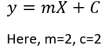

# Linear Regression
### What is Linear Regression?
Linear Regression is a statistical or mathematical approach for solving linear equations. A Linear Regression model finds the coefficient and intercepts from given input datas and predict output for any randomly given input.\
Linear Regression is the simpliest Machine Learning algorithm.
### When should we use Linear Regression?
1. When our dependent and independent variables are continious.
2. There needs to be a linear relationship between two variables.
3. There should be no significant outliner values in the data set.
### Real life fields where we use Linear Regression?
1. House price prediction
2. Blood pressure prediction
3. Car price prediction
4. Advertising cost prediction
5. Height prediction
### How Linear Regression works?
Let us consider, this is an dataset.\
\
Now the relation between X and y is\
\
Main motive of our model is to find the Intercept(m) and the coefficient(c).\
If we know the values of c and m, we can predict the output for any random input.
